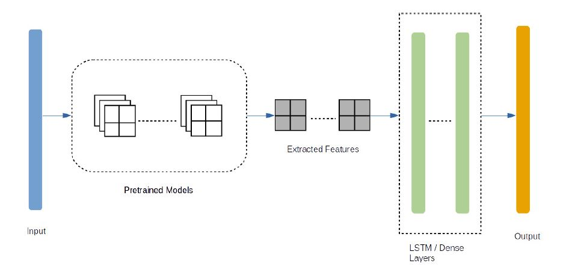

# Violence Detection using CNN + LSTM neural network

## Introduction:

Today, the amount of public violence has increased dramatically. As much in high schools as in the street. This has resulted in the ubiquitous use of surveillance cameras. This has helped the authorities to identify these events and take the necessary measures. But almost all systems today require the human-inspection of these videos to identify such events, which is virtually inefficient. It is therefore necessary to have such a practical system that can automatically monitor and identify the surveillance videos. The development of various deep learning techniques, thanks to the availability of large data sets and computational resources, has resulted in a historic change in the community of computer vision. Various techniques have been developed to address problems such as object detection, recognition, tracking, action recognition, legend generation, etc. However, despite recent developments in deep learning, very few techniques based on deep learning have been proposed to address the problem of detecting violence from videos.

## Dataset
•	Collected raw surveillance videos from YouTube, sliced them into clips within 5s at 20 fps, and labeled each clip as Violent or Non-Violent Behavior。

•	Finally we got 1600 clips and 160,000 frames as a new data set for real-world violent behavior detection under surveillance camera.

### Download
To download the released dataset, please:

Send to ming.cheng@dukekunshan.edu.cn .And ask him to send you the Agreement Sheet, sign it and then send it back to him again 
He will return an e-mail with download link to you as soon as possible.

## Flowchart : 
The method consists of extracting a set of frames belonging to the video, sending them to a pretrained network called VGG16, obtaining the output of one of its final layers and from these outputs train another network architecture with a type of special neurons called LSTM. These neurons have memory and are able to analyze the temporal information of the video, if at any time they detect violence, it will be classified as a violent video.

## Problems
Since all the videos are captured by surveillance cameras in public places, many of them may not have a good imaging quality due to dark environment, fast movement of object, lighting blur, etc.

## recommendation
I did not use all the data that I have because to train this model on a larger amount of data than this one needs super machine, and when training the model I noticed that the more data the more accurate the model. That is why it would be great to use a larger amount of data with a super computer.
In the end, our model provide an accuracy of  **74.58 %** on the **training** set and **76.25 %** on the **validation** set.
Because of the dilemmas i mentioned. I think this is a satisfying result .
